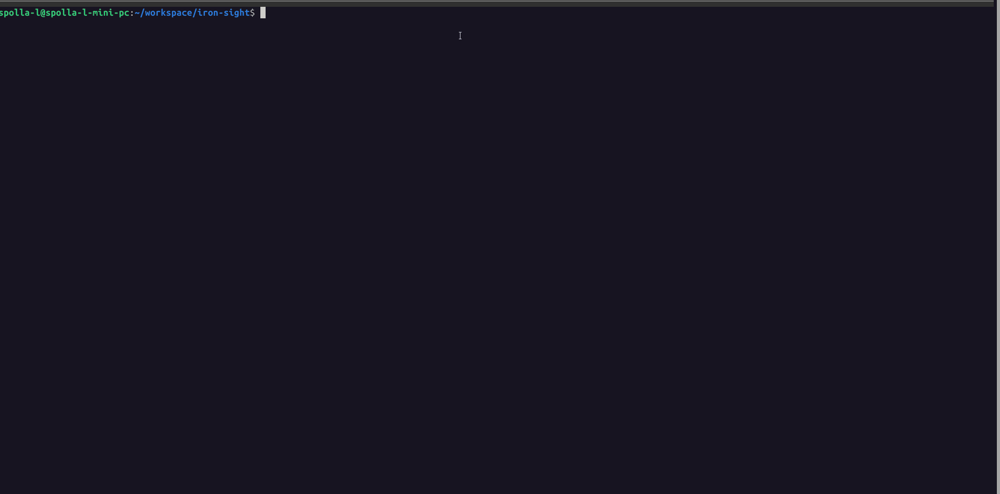

# datasight

A terminal viewer for CSV, TSV, Parquet, and JSON files with vim-style navigation, built with Rust and ratatui. Themed with [Catppuccin Mocha](https://github.com/catppuccin/catppuccin).

[](https://github.com/SpollaL/datasight/actions/workflows/ci.yml)
[](LICENSE)



## Features

- Vim-style navigation (`hjkl`, `g`/`G`, `PageUp`/`PageDown`)
- Search within a column (`/`, `n`/`N`)
- Multi-column filtering with comparison operators — `> 30`, `= Engineering`, `!= 0` (`f`, `F`)
- Unique values popup — browse and filter by distinct values instantly (`u`)
- Sort by any column (`s`)
- Group-by with per-column aggregations (`b`, `a`, `B`)
- Column plot — line, bar, or histogram chart (`p`, `t`)
- Column Inspector — schema and stats for every column at a glance (`i`)
- Column stats popup (`S`)
- In-app help popup (`?`)
- Catppuccin Mocha color theme with zebra-striped rows and mode-aware status bar
- Supports CSV, TSV, Parquet, JSON (`[{...}]`), and NDJSON/JSON Lines (`.ndjson`, `.jsonl`) files
- Custom delimiter support via `-d` flag — works with pipe-separated, semicolon-separated, and any single-character delimiter
- Pipe-friendly — reads from stdin with automatic format detection (CSV, JSON, NDJSON)
- Viewport-windowed rendering — stays fast on large files

## Install

### Pre-built binaries (recommended)

Download the latest binary for your platform from the [GitHub Releases](https://github.com/SpollaL/datasight/releases) page.

### Build from source

Requires Rust 1.75 or higher.

```
cargo install --git https://github.com/SpollaL/datasight
```

Or clone and run locally:

```
cargo run -- tests/fixtures/orders.csv
cargo run -- tests/fixtures/orders.tsv
cargo run -- tests/fixtures/orders.parquet
cargo run -- tests/fixtures/orders.json
cargo run -- tests/fixtures/orders.ndjson
cargo run -- -d '|' <path-to-file.psv>   # pipe-separated
cargo run -- -d ';' <path-to-file.csv>   # semicolon-separated
```

Sample fixtures for all supported formats are in `tests/fixtures/`.

### Pipe from stdin

datasight reads from stdin when no file is given. Format is detected automatically from content:

```bash
# CSV
cat data.csv | datasight

# TSV
cat data.tsv | datasight

# Pipe-separated via flag
cat data.psv | datasight -d '|'

# JSON array of objects
curl https://api.example.com/records | datasight

# Newline-delimited JSON
kubectl get pods -o jsonlines | datasight

# From a database
psql -c "\copy (SELECT * FROM orders) TO STDOUT CSV HEADER" | datasight
```

## Keybindings

### Navigation

| Key | Action |
|-----|--------|
| `j` / `Down` | Move down |
| `k` / `Up` | Move up |
| `h` / `Left` | Move left |
| `l` / `Right` | Move right |
| `g` / `Home` | Jump to first row |
| `G` / `End` | Jump to last row |
| `PageDown` | Scroll down 20 rows |
| `PageUp` | Scroll up 20 rows |

### Search

| Key | Action |
|-----|--------|
| `/` | Enter search mode (searches in current column) |
| `Enter` | Confirm search and jump to first match |
| `n` | Next match |
| `N` | Previous match |
| `Esc` | Exit search and clear results |

### Filter

| Key | Action |
|-----|--------|
| `f` | Enter filter mode (filters rows by current column) |
| `Enter` | Confirm filter and return to normal mode |
| `F` | Clear all filters |
| `Esc` | Discard input |

Supports comparison operators for numeric columns: `> 30`, `< 100`, `>= 0`, `<= 50`, `= 42`, `!= 0`.
Use `= text` or `!= text` for exact string matching. Plain text falls back to substring search.

### Unique Values

| Key | Action |
|-----|--------|
| `u` | Open unique values popup for current column (sorted by frequency) |
| type | Search / filter the list live |
| `j` / `k` | Navigate the list |
| `Enter` | Apply selected value as a filter and close |
| `Esc` | Close without filtering |

### Sort

| Key | Action |
|-----|--------|
| `s` | Sort by current column (toggles asc/desc) |

### Group By

| Key | Action |
|-----|--------|
| `b` | Toggle group-by key for current column |
| `a` | Cycle aggregation for current column (Σ μ # ↓ ↑) |
| `B` | Execute group-by / clear and return to full view |

### Plot

| Key | Context | Action |
|-----|---------|--------|
| `p` | Normal | Mark current column as Y and enter pick-X mode |
| `h` / `←` / `l` / `→` | Pick-X | Navigate to the X column |
| `Enter` | Pick-X | Confirm X column and show chart |
| `Esc` | Pick-X | Cancel and return to normal mode |
| `t` | Plot | Cycle chart type (line → bar → histogram) |
| `Esc` / `p` | Plot | Close chart and return to normal mode |
| `q` | Plot | Quit |

Numeric X columns are plotted directly. String or date X columns use row indices as data points and render the actual values as rotated (vertical) labels below the chart — all labels are shown when they fit, otherwise they are sampled evenly.

For histogram, the Y column is binned automatically — no X column selection needed.

### Column Inspector

| Key | Action |
|-----|--------|
| `i` | Open Column Inspector (type, count, nulls, unique, min, max, mean, median) |
| `j` / `k` | Navigate rows |
| `Enter` | Jump to the selected column and return to data view |
| `Esc` / `i` | Close and return to data view |

### Column Stats

| Key | Action |
|-----|--------|
| `S` | Toggle stats popup for current column (count, min, max, mean, median) |

### Other

| Key | Action |
|-----|--------|
| `i` | Open Column Inspector |
| `_` | Autofit current column width |
| `=` | Autofit all columns |
| `S` | Toggle column stats popup |
| `?` | Toggle help popup |
| `q` | Quit |

## Troubleshooting

**The display looks garbled or misaligned**

Your terminal may not support 256 colors or Unicode box-drawing characters. Try a modern terminal emulator (kitty, alacritty, iTerm2, Windows Terminal) and make sure `TERM` is set to `xterm-256color`.

**Columns are too narrow or too wide**

Press `=` to autofit all columns to their content, or `_` to autofit only the current column.

**Filtering with `>`, `<`, `>=`, `<=` shows an error**

These operators only work on numeric columns. Use `= value` or `!= value` for exact string matching, or plain text for substring search.

**The unique values popup shows fewer results than expected**

The popup is capped at the 500 most frequent values. If your column has more than 500 distinct values, the title will say `[top 500]`.

**Large files are slow to open**

datasight reads the entire file into memory on startup using Polars. In practice, load times are fast: a 42 MB / 1M-row CSV loads in under 0.1s using ~115 MB RAM. Multi-GB files will use proportionally more memory. Once loaded, navigation and filtering are fast regardless of row count.

**Parquet file fails to open**

Make sure the file is a valid Parquet file. Compressed or encrypted Parquet variants are not supported.
